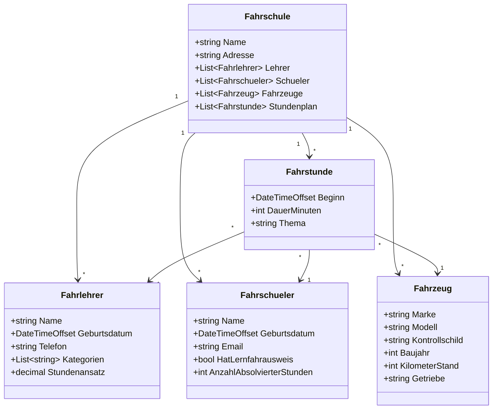
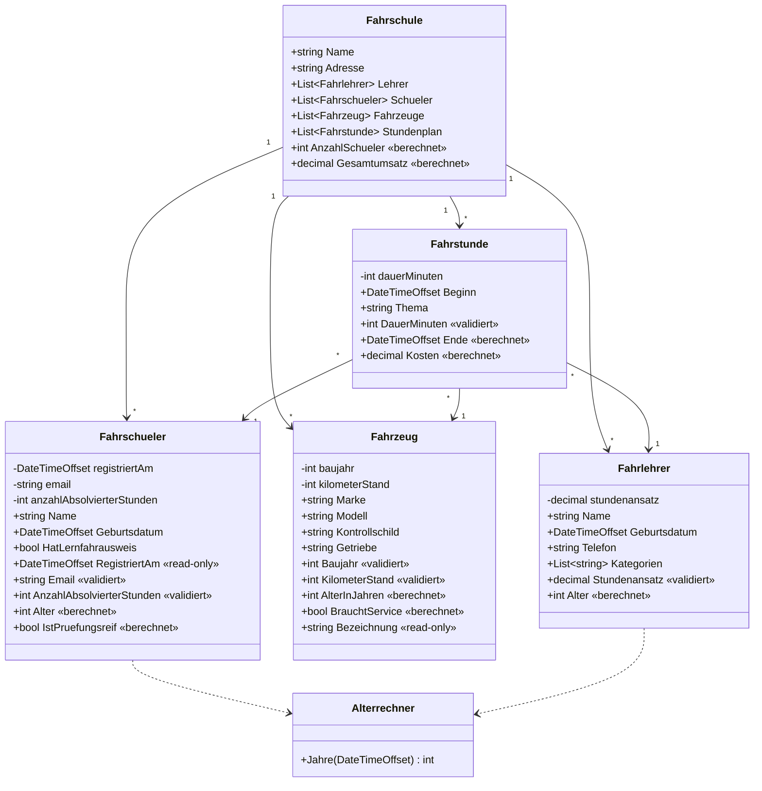

# Klassendiagramm Fahrschule (Aufgabe 3 und 4)
## Struktur mit Feldern (Aufgabe 3)

## Struktur mit Eigenschaften (Aufgabe 4)

## Wo steckt welche Anforderung aus Aufgabe 4

| Anforderung      | Umgesetzt in                                                      |
|------------------|-------------------------------------------------------------------|
| Read-Only        | `Fahrschueler.RegistriertAm`, `Fahrzeug.Bezeichnung`              |
| Berechneter Wert | `Fahrschueler.Alter`, `Fahrstunde.Kosten`, `Fahrschule.Gesamtumsatz` |
| Datenvalidierung | `Fahrzeug.KilometerStand`, `Fahrschueler.Email`, `Fahrstunde.DauerMinuten` |
