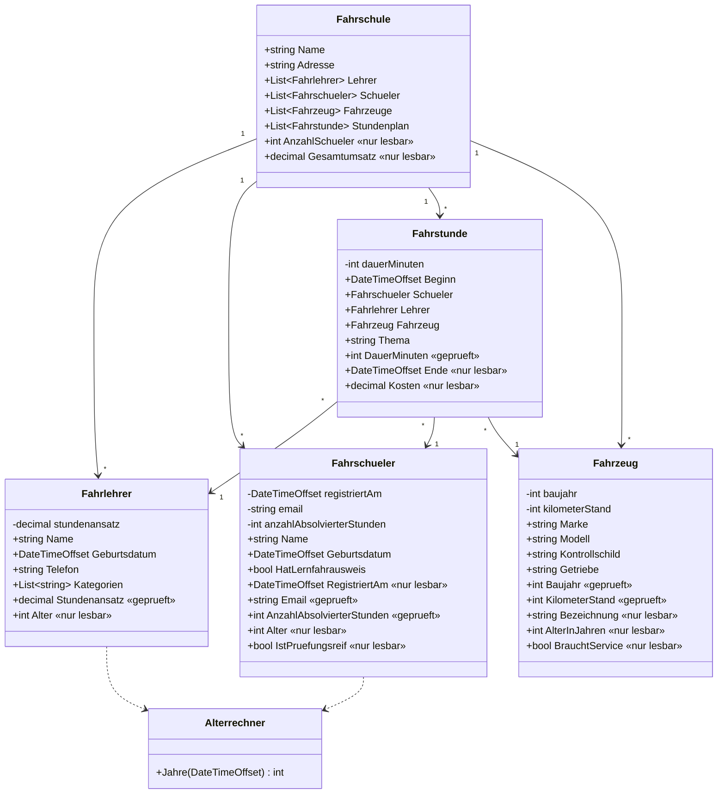

# UML-Klassendiagramm Fahrschule (Reverse Engineering)

Automatisch aus den Quelldateien in `Aufgabe4_Eigenschaften` erzeugt,
nicht von Hand gezeichnet. Enthaelt den vollen Datenumfang, also alle
Felder und Eigenschaften.

Legende der Marker:

- `«nur lesbar»` Eigenschaft ohne Setter, also Read-Only oder berechnet
- `«geprueft»` Setter prueft den Wert und lehnt ungueltige Eingaben ab
- `-` privat, `+` oeffentlich

